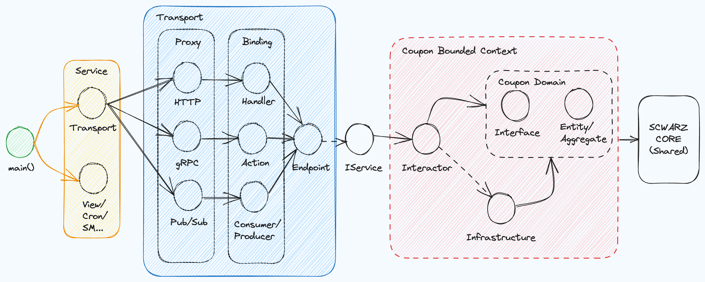

# Coupon Domain
The following diagram illustrates the application architecture implemented for the refactoring of the coupon service.

Application Architecture

The refactored coupon service adheres to the principles of Domain-Driven Design (DDD) and Clean Architecture. By applying these principles, we ensure a modular and scalable codebase that aligns with best practices in software development.

Furthermore, the refactored service has been implemented using the Go programming language, with careful consideration given to the Go community and idiomatic project structure. This ensures that the codebase is both efficient and maintainable, following established conventions and leveraging the strengths of the language.

By adopting DDD, Clean Architecture, and leveraging the strengths of Go, we aim to create a robust and extensible coupon service that meets the needs of our application and provides a solid foundation for future enhancements and improvements.
